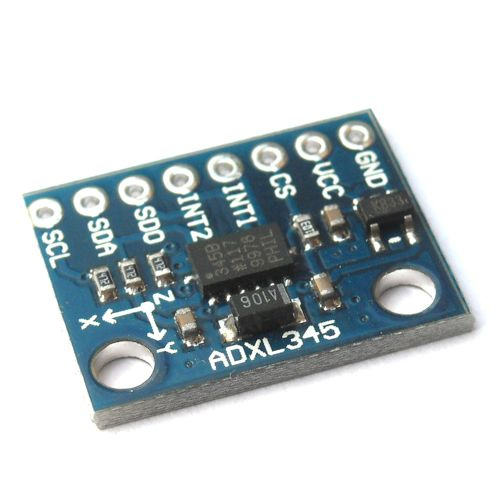
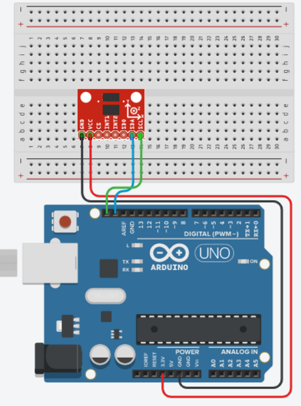
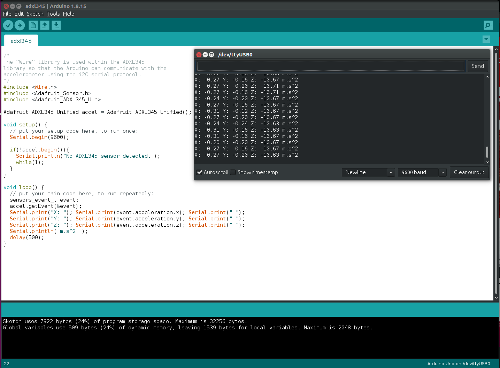

# ADXL345 3-Axis Accelerometer

## Hardware Required
- Arduino Uno
- ADXL345 module
- Breadboard
- Jumper Wires
- Arduino IDE

## Connections

## Result (Arduino IDE)

1. Copy the code in a newfile in Arduino IDE
2. Click Compile
3. Plug in the Arduino Uno with the connections completed
4. Click Upload
5. To see the output, open **Tools**->**Serial Monitor**

---
